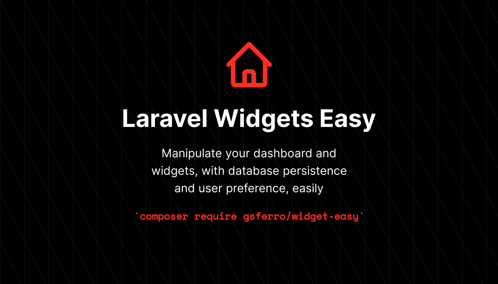
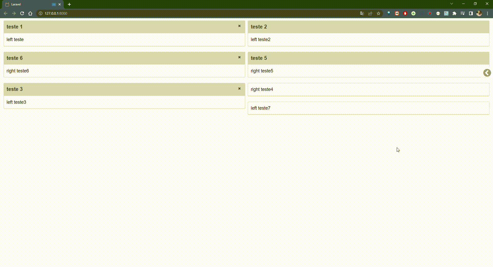

### Demo



### Dependencias

- [Jquery](https://jquery.com/download/)
- [Jquery UI](https://releases.jquery.com/ui/)
- [font-aewsome 4](https://fontawesome.com/v4.7.0/icons/)

### Instalação

```bash 
composer require gsferro/widget-easy && php artisan vendor:publish --provider="Gsferro\WidgetEasy\Providers\WidgetEasyServiceProvider" --force
```

```bash
@WidgeteasyCSS()
@WidgeteasyJS()
```

### Uso

- Estrutura básica
    ```html
    <x-widget-easy-container>
        <x-slot name="left">
            <!-- items iniciais do lado esquerdo --->
            <x-widget-easy-children id="<id>">
                <!-- seu componente / html --->
            </x-widget-easy-children>
        </x-slot>
    
        <x-slot name="right">
            <!-- items iniciais do lado direito --->
            <x-widget-easy-children id="<id>">
                <!-- seu componente / html --->
            </x-widget-easy-children>
        </x-slot>
    </x-widget-easy-container>
    ```

- Com Título
    ```html
    <x-widget-easy-children id="<id>" title="<title>">
        <!-- seu componente / html --->
    </x-widget-easy-children>
    ```

- Ocultável (Obrigatório Título)
    ```html
    <x-widget-easy-children id="<id>" title="<title>" isRemovible>
        <!-- seu componente / html --->
    </x-widget-easy-children>
    ```

### Informações Gerais

1. É necessário estar logado, pois é utilizado como pk `auth()->user()->id`


### License

- MIT License